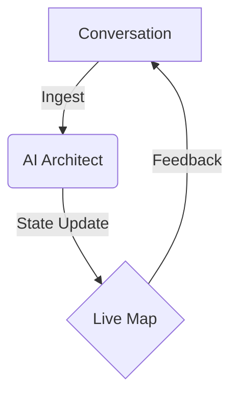

import Section from '../../components/layout/Section.astro';

<Section>

## Principle
Traditional process discovery is lossy. There is a chronological gap between the interview and the artifact. The process map shouldn't be a post-interview summary; it should be a real-time participant in the room.

## The Strategy
By shifting from "taking notes" to "live synthesis," the conversation becomes the substrate for the process map. The AI agent acts as a live architect, continuously reflecting the discovered reality back to the participants.

</Section>

<Section>

## Implementation: Real-time Streams
Clarity utilizes Server-Sent Events (SSE) to maintain a stateful connection between the discovery agent and the visual canvas. As the agent extracts process knowledge, it updates a LangGraph state, which is immediately pushed to the Mermaid-rendered frontend.

**Endpoint:** `POST /api/discover`
**Payload:** `{"user_input": "First we receive the invoice...", "zoom_level": 1}`
**Response:** `data: {"mermaid_syntax": "graph TD; ...", "internal_thought": "..."}`

</Section>

<Section>

## Result
The shift from artifact to participant. The "Clarity" comes not from a later report, but from the immediate visual alignment of all stakeholders during the session itself.

</Section>
